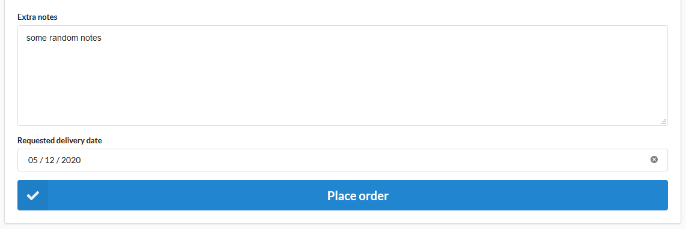
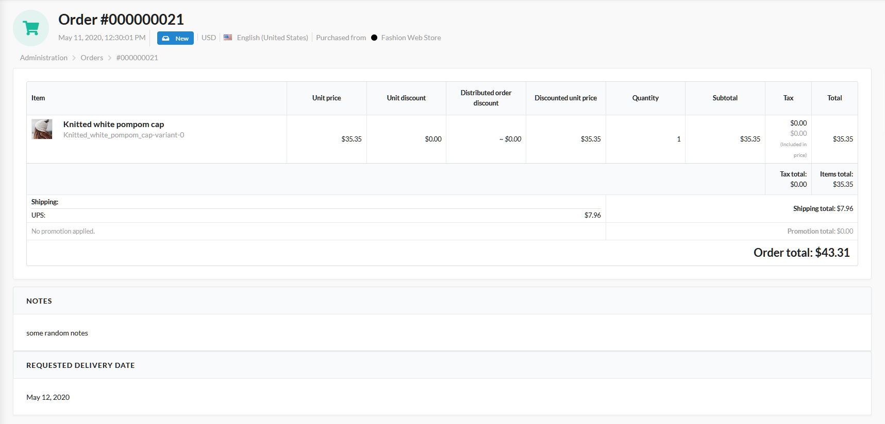

# Sylius Requested Delivery Date Plugin

[![Latest Version][ico-version]][link-packagist]
[![Latest Unstable Version][ico-unstable-version]][link-packagist]
[![Software License][ico-license]](LICENSE)
[![Build Status][ico-github-actions]][link-github-actions]

This plugin for [Sylius](https://sylius.com/) allows your customers to request a delivery date on their order.

Supports Doctrine ORM driver only.

## Screenshots

Shop:



Admin:



## Installation

### Step 1: Install the plugin

Open a command console, enter your project directory and execute the following command to download the latest stable version of this plugin:

```bash
$ composer require tavy315/sylius-requested-delivery-date-plugin
```

This command requires you to have Composer installed globally, as explained in the [installation chapter](https://getcomposer.org/doc/00-intro.md) of the Composer documentation.

### Step 2: Enable the plugin

Then, enable the plugin by adding it to the list of registered plugins/bundles in `config/bundles.php` file of your project:

```php
<?php
$bundles = [
    Tavy315\SyliusRequestedDeliveryDatePlugin\Tavy315SyliusRequestedDeliveryDatePlugin::class => ['all' => true],
];
```

### Step 3: Configure the plugin
```yaml
# config/packages/tavy315_sylius_requested_delivery_date.yaml

imports:
    - { resource: "@Tavy315SyliusRequestedDeliveryDatePlugin/Resources/config/app/config.yaml" }
```

### Step 4: Customize models

Read more about Sylius models customization [here](https://docs.sylius.com/en/latest/customization/model.html).

#### Customize your Order model

Add a `Tavy315\SyliusRequestedDeliveryDatePlugin\Model\Order\RequestedDeliveryDateTrait` trait to your `App\Entity\Order\Order` class.

- If you use `annotations` mapping:

    ```php
    <?php 
    // src/Entity/Order/Order.php
    
    namespace App\Entity\Order;

    use Doctrine\ORM\Mapping as ORM;
    use Sylius\Component\Core\Model\Order as BaseOrder;
    use Tavy315\SyliusRequestedDeliveryDatePlugin\Model\Order\RequestedDeliveryDateInterface;
    use Tavy315\SyliusRequestedDeliveryDatePlugin\Model\Order\RequestedDeliveryDateTrait;
    
    /**
     * @ORM\Entity
     * @ORM\Table(name="sylius_order")
     */
    class Order extends BaseOrder implements RequestedDeliveryDateInterface
    {
        use RequestedDeliveryDateTrait;
    }
    ```

### Step 5: Update your database schema

```bash
$ php bin/console doctrine:migrations:diff
$ php bin/console doctrine:migrations:migrate
```
 
### Step 6: Add labels to your product templates 
Add the new `requestedDeliveryDate` field to your template. By default, you should use `templates/bundles/SyliusShopBundle/Checkout/Complete/_form.html.twig` path.

```twig
{{ form_row(form.notes, sylius_test_form_attribute('extra-notes')|merge({'rows': 3})) }}
{{ form_row(form.requestedDeliveryDate) }}
```

## Usage

From now your customers should be able to request a delivery date.

[ico-version]: https://poser.pugx.org/tavy315/sylius-requested-delivery-date-plugin/v/stable
[ico-unstable-version]: https://poser.pugx.org/tavy315/sylius-requested-delivery-date-plugin/v/unstable
[ico-license]: https://poser.pugx.org/tavy315/sylius-requested-delivery-date-plugin/license
[ico-github-actions]: https://github.com/tavy315/SyliusRequestedDeliveryDatePlugin/workflows/build/badge.svg
[ico-code-quality]: https://img.shields.io/scrutinizer/g/tavy315/SyliusRequestedDeliveryDatePlugin.svg

[link-packagist]: https://packagist.org/packages/tavy315/sylius-requested-delivery-date-plugin
[link-github-actions]: https://github.com/tavy315/SyliusRequestedDeliveryDatePlugin/actions
